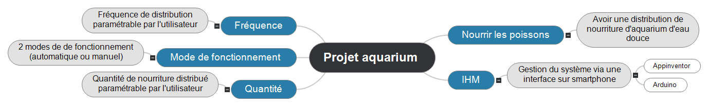
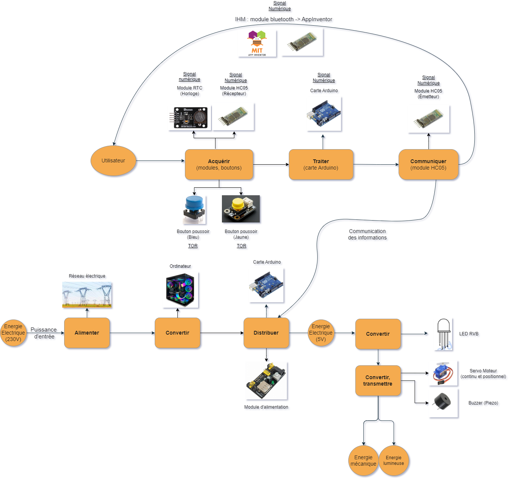
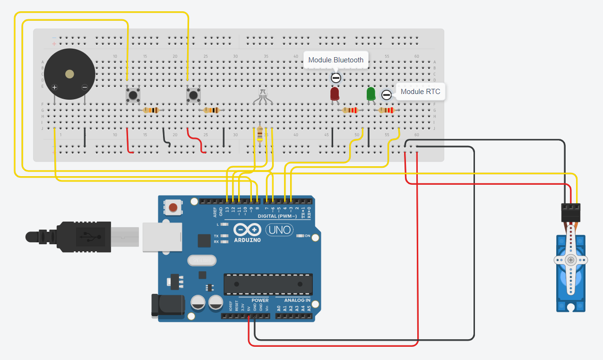
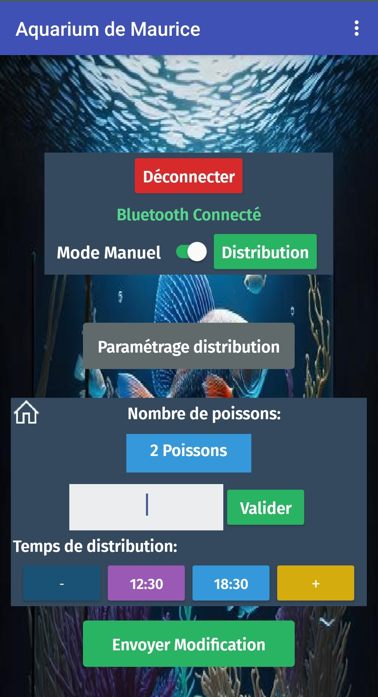
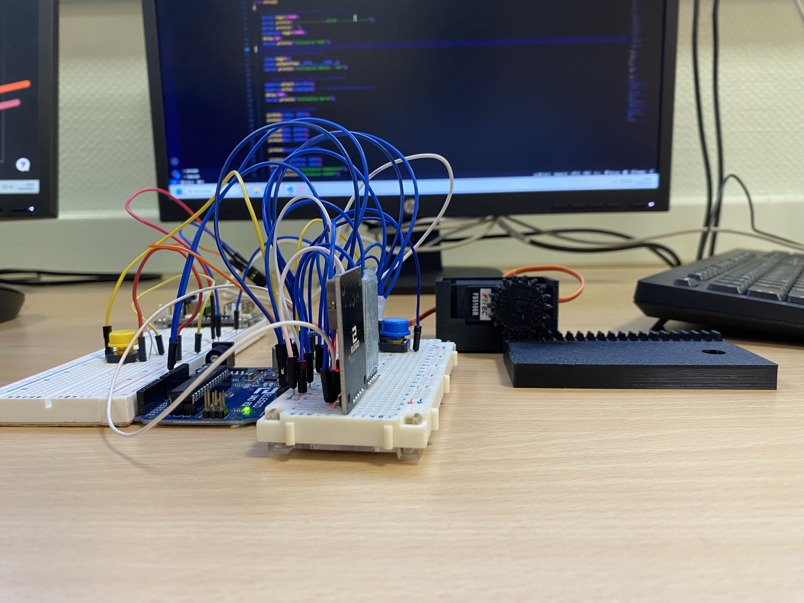

# Projet Aquarium - Terminale STI2D SIN

Réalisation d'un distributeur automatique de nourriture pour poisson (Aquarium Assit) pour permettre de distribuer la nourriture malgrès l'absence de l'utilisateur grâce à des pièces modélisés en 3D et un système informatique (Arduino, Servo Moteur, AppInventor).

Ce projet a été réalisé dans notre cursus pour le Baccalauréat STI2D, durant l'année de Terminale.

**Éxigences :**



**Chaine de puissance & d'information :**



**Simulation sur TinkerCad :**



**Système final :**






## Indispensables pour réalisations

Pour mettre en oeuvre ce projet, vous avez besoin d'une carte Arduino UNO (Carte utilisé pour le projet), des éléments associés (LED RVB, Boutons (2), Buzzer, Résistances, Module RTC), un module de transmission (HC05) et pour combler tout cela, une petite application AppInventor (Controle à distance) ainsi qu'un téléphone Android pour la liaison.

- [Arduino IDE](https://www.arduino.cc/en/software)
- [Libraries](https://github.com/SimSim236/Smart-Aquarium/tree/main/librairies)

**Outils importants :**

- [Tinkercad : Simulations](https://www.tinkercad.com/)
- [Arduino Doc, FAQ](https://www.arduino.cc/)
- [AppInventor : Application mobile](https://appinventor.mit.edu/)

## Installation

1. Clonez le dépôt :
   ```bash
   git clone https://github.com/SimSim236/Smart-Aquarium.git
   ```
2. Ouvrez le fichier `Aqua.ino` avec l'IDE Arduino.
3. Installez les [Libraries](https://github.com/SimSim236/Smart-Aquarium/tree/main/librairies) nécessaires.
4. Connectez votre carte Arduino à votre ordinateur.
5. Compilez et téléversez le code sur votre carte.

6. Installez l'application AppInventor sur votre téléphone Android (AquariumMaurice.apk).
7. Lancer l'application et connectez-vous au module Bluetooth.

## License

[MIT](https://choosealicense.com/licenses/mit/)

## Authors

- [🔆 - Sim](https://www.github.com/SimSim236)
- [🎗️ - Lutr4nn](https://www.github.com/Lutr4nn)
